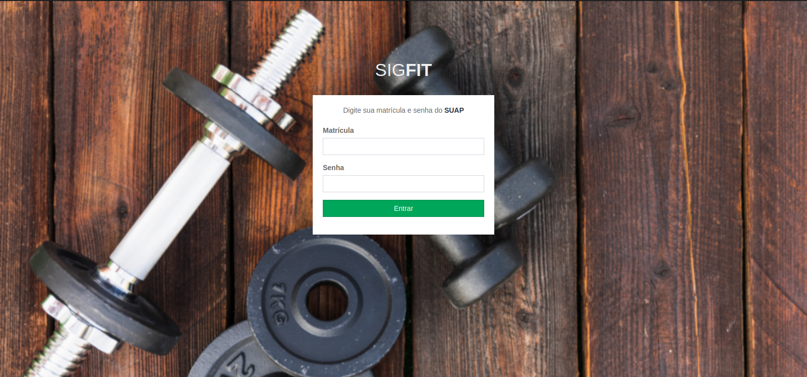
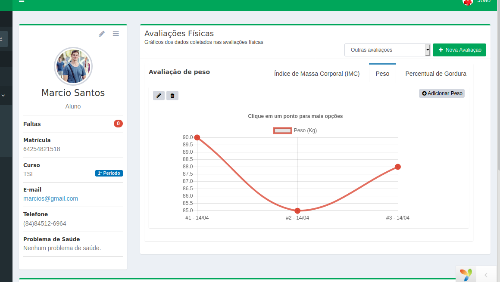
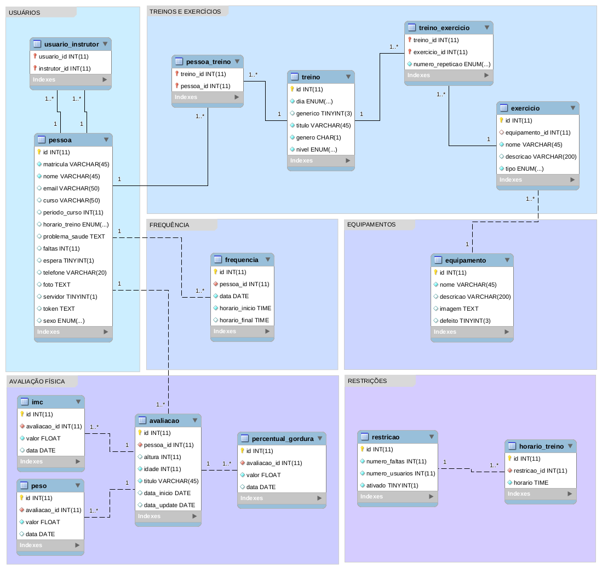

## SIGFIT

>Projeto de pesquisa para auxiliar os instrutores da academia do **IFRN - RN Campus Currais Novos**

### Screens shorts
 Outras screens shorts podem ser vistos [aqui.](https://github.com/HermersonDev/projeto-sigfit/tree/master/docs/imgs)

### Requisitos implementados

- **Avaliação Física:** A avaliação física é feita com o uso de balança, fita métrica, adipômetro(usado para medir o percentual de gordura) e IMC. As avaliações são feitas a cada 2 à 3 meses.
- **Frequência dos Usuários:** A frequência é registrada por assinatura do usuário junto com a apresentação da carteirinha. A frequência tem duas etapas check in e check out.
- **Check in:** O usuário deve informar seu nome, curso, matrícula e o horário de início do treino.
- **Check out:** O usuário deve informar o horário de final do treino.
- **Faltas do Usuário:** Usuário que ultrapassar o número máximo de faltas, deve ficar na fila dos excluídos.
- **Cadastro de Usuário:** O usuário deve trazer o RG, foto 3x4 e a declaração de matrícula, como também preencher um formulário informando os seguintes dados: nome, email, matrícula, telefone, dia do treino, horário do treino, curso e problemas de saúde.
- **Atualização do Treino:** O treino é atualizado com relação a evolução e o intuito do usuário.
- **Listas de Treinos Genéricos:** Para usuários iniciantes, são definidos treinos genéricos que são utilizados de acordo com os objetivos do usuário, seja, para perda de peso ou para ganho de massa magra.
Há treinos específicos para homens e mulheres.
- **Exercícios dos Equipamentos:** Os instrutores conhecem a maioria dos exercícios dos equipamentos, porém exercícios mais específicos não são todos conhecidos.
- **Equipamento com Defeito/Problema:** Quando um equipamento estiver com problema ou defeito o instrutor deve comunicar à assistência.
- **Controle dos Equipamentos:** Os dados dos equipamentos são mantidos em uma planilha. Com as colunas de id, nome do equipamento/material e quantidade.
- **Carteirinha:** Cada usuário deve conter uma carteirinha com as seguintes informações: nome, horário de treino, curso, dias de treino, assinatura do aluno, assinatura da direção e uma foto.
- **Treino Modificado:** Dependendo da condição de saúde do usuário, o treino genérico pode ser modificado para que atenda as restrições físicas do usuário.
- **Fila de Espera:** Fila de espera é onde fica o usuário que solicitou um horário de treino, porém este horário está lotado, ou seja, atingiu o máximo de usuários que podem treinar por período de 1 hora.
- **Fila dos Excluídos:** Fila dos excluídos é onde fica os usuários que ultrapassaram o máximo de faltas. O usuário que estiver na fila dos excluídos, deve esperar abrir novas vagas na fila de espera.
- **Administrador:** O administrador do sistema, poderá fazer o gerenciamento dos instrutores da academia(CRUD).
- **Abonação de Faltas:** O instrutor poderá abonar as faltas de um usuário, caso este tenha uma justificativa.

### Banco de dados
